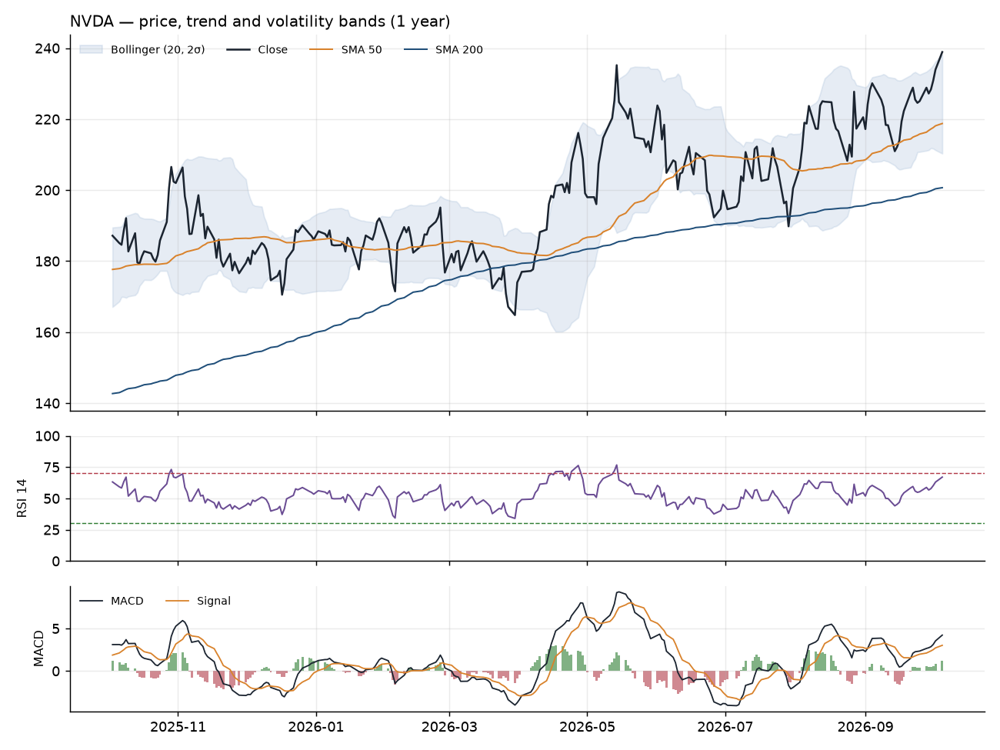

# NVIDIA Corporation (NVDA): Equity Research Brief
*As of 2026-10-05 · Generated 2026-10-06 08:56 UTC*

## Company Snapshot
| Metric | Value |
|---|---|
| Price | 238.9 USD |
| 52-week range | 163.9 to 240.1 |
| YTD return | +28.4% |
| P/E (trailing) | 30.2 |
| Sector | Technology |

## Technical Outlook
Momentum score **3** (bullish).

- Price is +9.2% vs SMA-50 and +19.0% vs SMA-200.
- Trend regime: golden-cross (SMA-50 above SMA-200), last cross 319 sessions ago.
- SMA-200 20-session slope: +2.23% (rising).
- MACD is above its signal line for 9 sessions; histogram expanding over the last 5 sessions.
- RSI-14 at 67.0, +10.9 points over 20 sessions.
- Bollinger %B 1.03 (above upper band); bandwidth at 44% percentile of 6 months -> normal.
- 20-session price return: +3.8%.

## News Sentiment
Aggregate score **+0.51** (positive) from 10 headlines:
6 positive, 3 neutral, 1 negative.

| Headline | Sentiment | Confidence | Reason |
|---|---|---|---|
| The Zacks Analyst Blog Highlights Lam, Taiwan, Marathon, NVIDIA, Micron and Alphabet | neutral | 0.90 | This is a generic listicle or roundup article that does not provide specific new information or analysis on NVIDIA. |
| OneAscent Wealth Management LLC Increases Stock Position in NVIDIA Corporation $NVDA | positive | 0.85 | Institutional buying signals increased investor confidence and demand for the stock. |
| Why Are Nasdaq, Dow Futures Rising Premarket? SPCX, NVDA, CEG, AMD, ORCL, NOK In Focus | neutral | 0.80 | The headline is a general market overview and does not provide specific news or material information regarding NVIDIA. |

## Recommendation: Hold (medium conviction)
NVDA is exhibiting strong structural momentum with a well-established golden cross and a rising 200-day moving average, confirming a robust primary uptrend. However, the current price action has pushed the stock above the upper Bollinger Band, as evidenced by a %B of 1.03, suggesting the asset is technically overextended in the short term. While the expanding MACD histogram and RSI support continued bullish participation, the proximity to the 52-week high creates a high probability of a mean-reversion pullback. Investors should wait for a consolidation phase or a retest of the 50-day moving average before adding to existing positions.

**Key drivers:** Overextended Bollinger Band position, Strong structural trend alignment, Positive momentum divergence risk

---
**Risk disclaimer.** This brief is generated automatically by a language model from public market data and news
headlines. It is for educational purposes only, is not investment advice, and has not been reviewed by a licensed
analyst. Technical indicators are backward-looking, LLM outputs can be wrong, and past performance does not guarantee
future results. Do your own research and consult a qualified financial adviser before making investment decisions.