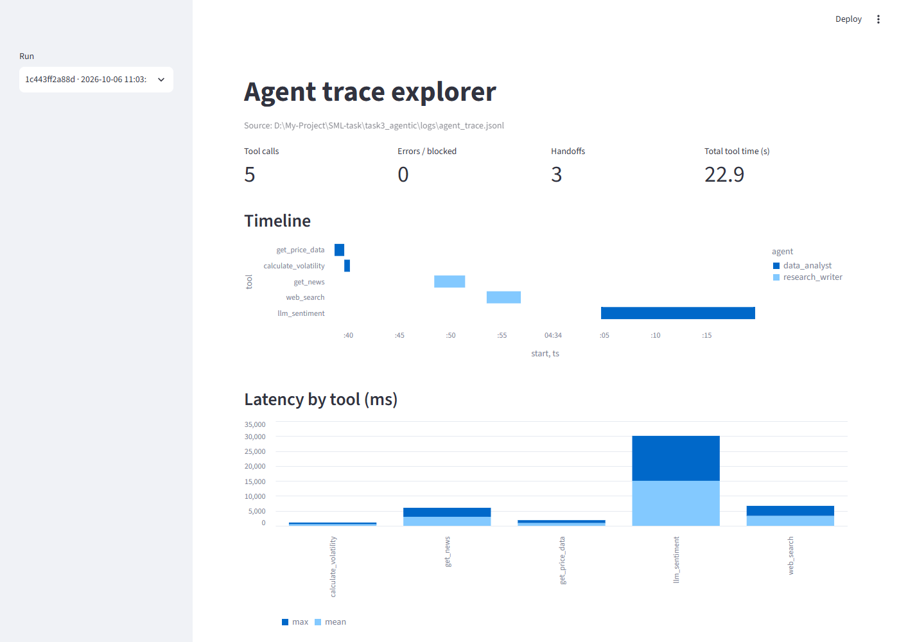

# Task 3: Multi-Agent Financial Research System

[](https://colab.research.google.com/github/krishanSKDA/CDAZZDEV-MLE-Krishan_Danushka/blob/main/task3_agentic/Task3_Agentic.ipynb)

| File | Purpose |
|---|---|
| `tools.py` | `get_price_data`, `get_news`, `calculate_volatility`, `llm_sentiment`, `web_search`: return dicts, never raise |
| `tracing.py` | `@traced` decorator → `logs/agent_trace.jsonl` (tool, inputs, output ≤ 200 chars, duration, status); permission checks; failure injection |
| `agent_core.py` | Tool-calling model over OpenAI-compatible endpoints (Gemini, optional OpenRouter fallback), tool execution, malformed-tool-call repair, ReAct loop, message printer |
| `single_agent.py` | 3A: LangGraph `agent → tools → agent … → report` with `MemorySaver` short-term memory |
| `multi_agent.py` | 3B: Data Analyst → Research Writer → critique → Analyst → final report, with Pydantic handoffs |
| `memory.py` | Persistent cache `cache/{TICKER}_{YYYY-MM-DD}.json` |
| `schemas.py` | `DataBrief`, `ClarificationRequest`, `ClarificationResponse`, `ResearchReport` |
| `dashboard.py` | Streamlit trace explorer (bonus) |

## Coordination design
Agent A (Data Analyst) has no news access, so its first brief records sentiment as a data gap. Agent B (Research Writer)
collects headlines and web commentary, then sends a `ClarificationRequest` with its headlines attached. Agent A scores
them with `llm_sentiment` (or computes another requested metric) and returns a `ClarificationResponse`. Agent B must
use that response in the final report. Neither agent can produce the report alone. The critique round is capped at one
by a counter in graph state.

## Trace dashboard (bonus)
A Streamlit app that reads `logs/agent_trace.jsonl` and shows, for each run, the tool-call count, errors or blocked
calls, handoffs, a per-agent timeline and latency per tool.
```bash
streamlit run task3_agentic/dashboard.py
```


LangSmith alternative: set `LANGSMITH_TRACING=true` and `LANGSMITH_API_KEY`. LangGraph reports runs automatically.
